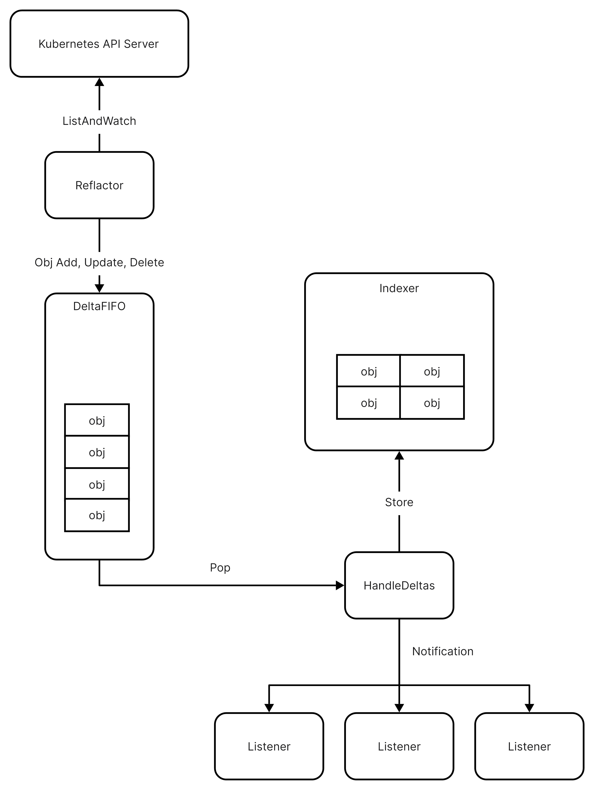

+++
title = "Kubernetes | client-go Overview"
date = 2023-10-11T21:01:13+08:00
draft = false
tags = [
  "Tech",
  "Kubernetes",
]
keywords = [
  "Kubernetes",
  "client-go",
  "code reading",
]
+++

## client-go Introduction

[client-go](https://github.com/kubernetes/client-go) is the official Go client library for Kubernetes. It provides a set of Go packages that implement the Kubernetes API concepts. It's a powerful library that can be used to interact with the Kubernetes API. Almost all the kubectl commands and operators in Kubernetes are implemented using client-go.

Instead of being a simply REST HTTP client, client-go has the capability to **cache the Kubernetes API objects in memory**, so that users can get the objects from the cache directly without sending requests to the Kubernetes API server frequently. Cache, saving the time of client and saving the load of API server, is the most interesting feature of client-go.

The cache feature is implemented through an **informer** mechanism in client-go, and we will take a overview on what it is in this article.

## client-go Informer

An **informer** is initialized to focus a single Kubernetes API object type, such as PodList, DeploymentList, etc. It will watch the changes of the object type from the Kubernetes API server, and then store the objects in the cache. The informer will also notify the registered listeners when the objects are changed.

There are 3 main components in an informer:

1. **Reflector**: The Reflector is responsible for listing and watching the changes of the object type from the Kubernetes API server, and then insert a `Delta` into the **DeltaFIFO** queue. The `Delta` contains 2 fields: `Object interface{}` that represent the Kubernetes Object and the `Type DeltaType` that represent the type of the change, such as `Added`, `Updated`, `Deleted`, etc.
2. **DeltaFIFO**: The DeltaFIFO is a queue that stores the `Delta` objects. It's a thread-safe queue that can be accessed by multiple goroutines. The producer of the queue is the Reflector, and the consumer of the queue is the function `HandleDeltas`. The `HandleDeltas` function also notifies the registered listeners when the `Delta` is popped from the queue.
3. **Indexer**: The Indexer is a thread-safe cache that stores the Kubernetes objects in memory. The `HandleDeltas` function put the `Delta` into the Indexer, so that the Indexer can be synced with Kubernetes API Server.

In the following blogs, we will take a deep dive into the implementation of the 3 main components, to understand how the client-go author design & implement this powerful informer mechanism.